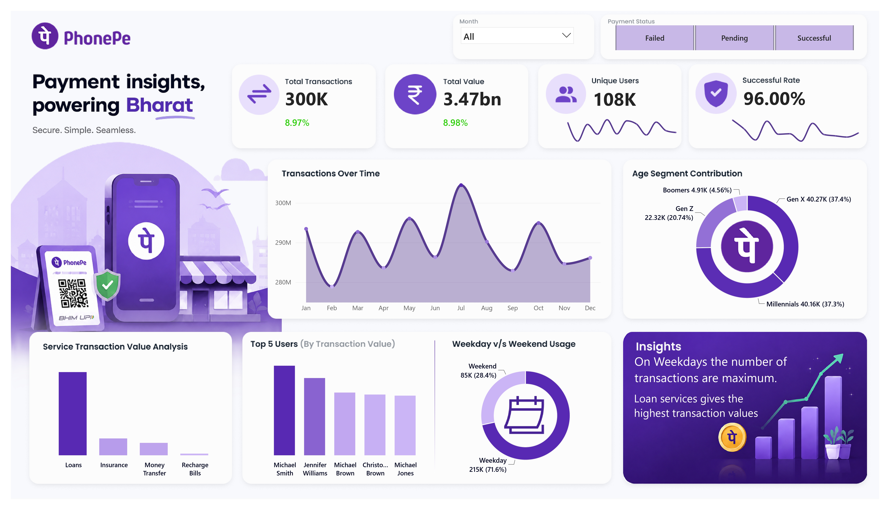
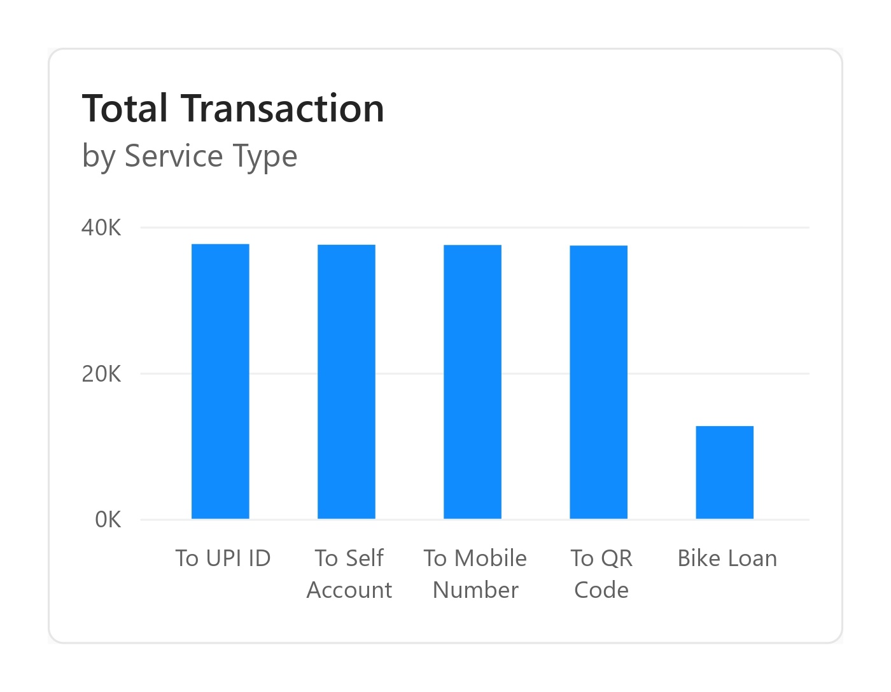
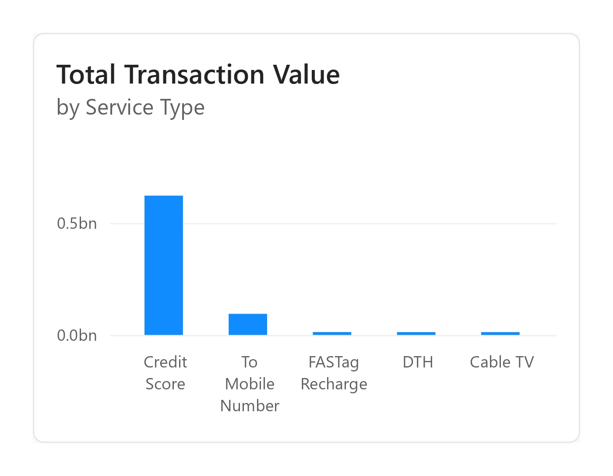

# 📊 PhonePe Transaction Analytics Dashboard

An interactive **Power BI dashboard** built to analyze PhonePe transaction data and uncover actionable business insights through KPI monitoring, trend analysis, customer segmentation, and service performance evaluation.

---

## 🚀 Project Overview

This dashboard provides a comprehensive view of PhonePe's transaction ecosystem by tracking key business metrics such as transaction volume, transaction value, user growth, and success rates.

The goal of this project is to transform raw transaction data into meaningful insights that support data-driven decision-making.

---

## 📸 Dashboard Preview

### Main Dashboard


---

## 🛠️ Tools & Technologies

- **Power BI**
- **DAX (Data Analysis Expressions)**
- **Power Query**
- **Data Modeling**
- **Data Visualization**
- **Business Intelligence**

---

## 📈 Key Performance Indicators (KPIs)

| Metric | Value |
|----------|----------|
| Total Transactions | 300K |
| Total Transaction Value | ₹3.47 Billion |
| Unique Users | 108K |
| Successful Transaction Rate | 96% |

---

## 🎯 Dashboard Features

### 1. Transaction Performance Monitoring
- Total Transactions
- Transaction Value
- Month-over-Month Growth
- Transaction Success Rate

### 2. User Analytics
- Unique User Tracking
- Top Users by Transaction Value
- User Contribution Analysis

### 3. Service Performance Analysis
- Loan Services
- Insurance
- Money Transfer
- Recharge Bills

### 4. Customer Segmentation
- Gen Z
- Millennials
- Gen X
- Boomers

### 5. Usage Behavior Analysis
- Weekday vs Weekend Transactions
- Monthly Transaction Trends
- Payment Status Tracking

### 6. Interactive Filtering
- Month Filter
- Payment Status Filter
- Dynamic Visual Interactions

---

## 📊 Visualizations Included

### Transaction Trend Analysis


### Additional Dashboard View


---

## 💡 Key Insights

### 🔹 User Activity
- Over **108K unique users** were recorded.
- Millennials and Gen X contribute the largest user base.

### 🔹 Transaction Success
- The platform maintains an impressive **96% success rate**.

### 🔹 Service Contribution
- Loan services generate the highest transaction value.

### 🔹 Usage Pattern
- Weekday transactions significantly exceed weekend activity.

### 🔹 Business Growth
- Positive month-over-month growth observed in transaction volume and transaction value.

---

## 🧮 DAX Measures Used

Some of the custom measures created:

```DAX
Total Transaction = COUNT(All_Transactions[Transaction_ID])

Total Users = DISTINCTCOUNT(All_Users[User_ID])

Successful Transaction =
CALCULATE(
    [Total Transaction],
    All_Transactions[Payment_Status] = "Successful"
)

Successful Rate =
DIVIDE(
    [Successful Transaction],
    [Total Transaction]
)
```

---

## 📂 Repository Structure

```text
phonepe/
│
├── Dashboard.jpg
├── tooltip1.jpg
├── tooltip2.jpg
├── PhonePe Dashboard.pbix
├── README.md
│
└── Dataset/
    └── Source Files
```

---

## 🎯 Business Value

This dashboard enables stakeholders to:

- Monitor transaction performance in real-time
- Identify high-performing services
- Understand customer demographics
- Track platform reliability
- Support strategic business decisions

---

## 🔮 Future Enhancements

- Regional Analysis
- Revenue Forecasting
- User Retention Metrics
- Fraud Detection Indicators
- Real-Time Data Integration

---

## 👨‍💻 Author

**Pritam Sanki**

If you found this project useful, feel free to ⭐ the repository and connect with me on LinkedIn.

---

### ⭐ Don't forget to star this repository if you like the project!
